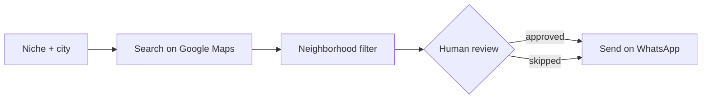

<h1 align="center">Gustavo Valadares</h1>

  Full-stack developer · Computer Science student at <b>UFG</b> (Federal University of Goiás), Brazil

  
  
  

  

Most of my code lives in private repositories, so this page describes what I actually build.

---

## 🚀 Soluia — Full-Stack Developer · May 2026 – present · *private code*

B2B AI software startup. WhatsApp-based CRM and lead prospecting platform, in production.

- 🤖 Migrated lead prospecting from an **n8n** workflow to a **LangGraph** agent in the backend — search, preparation, optional human review and dispatch — integrating Google Maps (via Apify) and OpenAI.
- 💰 Built neighborhood-level lead search with **cost control**: geocoder validation before spending credits, scraping ceiling, and aborting the run once the requested amount is reached.
- 🐳 Deployed the application to a VPS with Easypanel (Docker containers).

`React 18` `TypeScript` `Python` `FastAPI` `PostgreSQL` `LangGraph` `Docker`

---

## ⚽ Talent2Show — Full-Stack Developer · Aug 2025 – Aug 2026 · *private code*

Social network and sports management platform for football.

- 🔁 Built **recurring events** end to end: **RRULE (RFC 5545)** rules, a background job with a sliding window, local-to-UTC conversion, and `THIS` / `THIS_AND_FOLLOWING` / `ALL` edit scopes — React components included, covered by Jest and Cypress.
- 🔐 Built the first version of the **Google Calendar integration** via **OAuth 2.0**: HMAC-SHA256 state with constant-time comparison, encrypted tokens, automatic refresh and revocation.
- ♻️ Delivered the reusable templates module, with race-condition handling in the backend and per-profile caching with React Query.

`React` `TypeScript` `Node.js` `Express` `Prisma` `MySQL` `RabbitMQ`

---

## ⚖️ Goiás State Court of Justice (TJGO) — IT Intern · Jul 2026 – present

Python **RPA** over a legacy system with no API, for looking up and triaging case records. Spreadsheet cross-referencing with **pandas** and **gspread**.

---

## 🧠 How I work with AI

I use AI as a tool under a protocol of my own: threat-surface assessment before coding, step-by-step review of what is generated, tests, and a security review of the actual diff before shipping.

---

## 📦 Public repositories

Mostly coursework and small personal tools — the production work above is private.

- **[OOS-Trabalho-Tecnico-Estagio](https://github.com/Gustavo-Valadares/OOS-Trabalho-Tecnico-Estagio)** — object-oriented system in C++ simulating character interaction in a game (health, mana, shield, attack).
- **[ImgSentinel](https://github.com/Gustavo-Valadares/Automation/tree/master/ImgSentinel)** — Python folder organizer that watches "downloads" directory and sorts images to "images" directory automatically.
- **[Ticket-Purchase-System](https://github.com/Gustavo-Valadares/Ticket-Purchase-System)** — C++ ticket management system that simulates buying and selling tickets for different events, including event handling, user interaction, and transaction logic.

---

## 📊 GitHub

  

---

  <a href="https://www.linkedin.com/in/gustavo-henrique-valadares-402b8a24a">LinkedIn</a> ·
  gustavoh.valadares@outlook.com · Goiânia, Brazil

